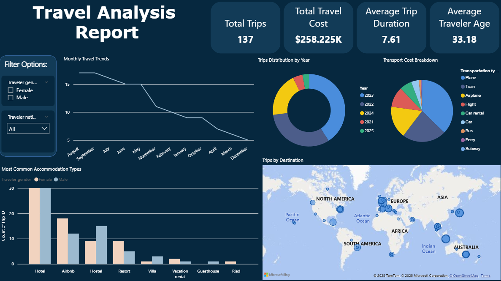
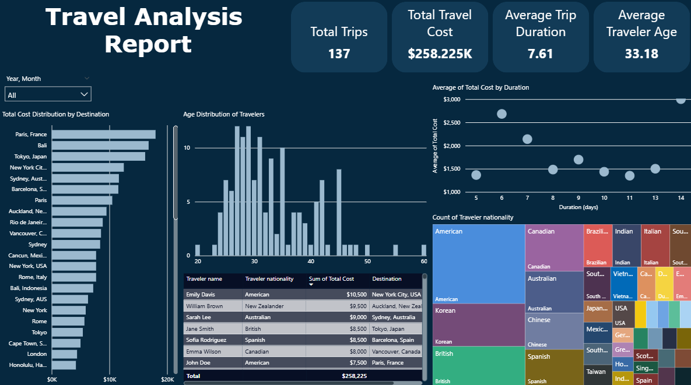

# Travel Analysis Dashboard
# 📊 Travel Analysis Dashboard

A data analysis project using Power BI to explore and visualize key trends and insights from a travel dataset.

---

## 🌟 Project Overview

This project focuses on analyzing a dataset of travel details to understand customer behavior, spending habits, and travel trends. The goal was to transform raw data into a set of interactive dashboards that provide actionable insights. The key areas of analysis include:

- **Travel Costs:** A breakdown of accommodation vs. transportation expenses across different destinations.
- **Traveler Demographics:** An analysis of traveler age, gender, and nationality.
- **Travel Trends:** Identification of seasonal patterns and most popular destinations.

---

## 🛠️ Tools and Technologies

- **Power BI:** Used for data modeling, visualization, and dashboard creation.
- **Travel details dataset:** The primary dataset used for the analysis.

---

## 📋 Key Insights

The dashboards revealed several important findings:

- **Cost vs. Destination:** Accommodation costs consistently made up the largest portion of total trip expenses, especially in popular destinations like London and Bali.
- **Traveler Demographics:** The age group of 25-30 years old was the most active in travel.
- **Accommodation Preferences:** The choice of accommodation (e.g., Hotel, Airbnb, Resort) varied significantly by destination, likely influenced by local availability and traveler preferences.

---

## 📈 Dashboards

Here are screenshots of the interactive dashboards created for this project:

1. **Travel Performance Summary:**  
   
   
2. **Traveler Demographics & Preferences:**  
   

---

